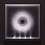
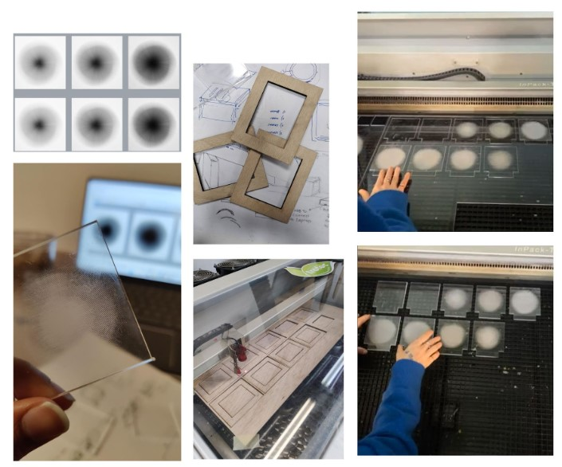
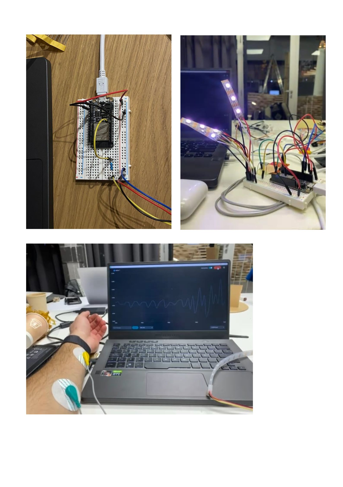
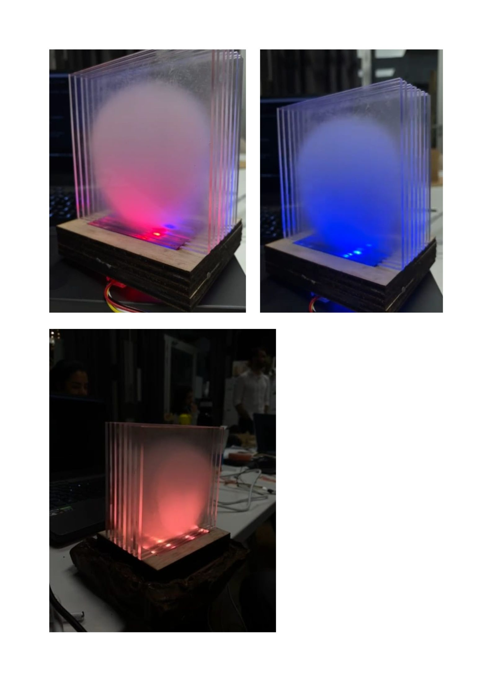

# Microchallenge1

Heart Aura

Idea/Concept and Purpose:

Our interests overlapped in concepts surrounding mental and physical health, and a more holistic perspective on wellness. We discussed the wisdom that our bodies hold, and their constant expression of feeling. It is important to listen to our bodies and follow what they desire if we want to enjoy living well. So, we decided to prototype a biofeedback device that aids in understanding information that our nervous systems are transmitting so as to provide tools to improve wellbeing. We thought, what if we can visualize clearly what our nervous system is expressing? Can this help us to control our bodily states and the way our minds interpret existence?

We decided to explore this concept by building a model that visualizes Heart Rate Variability (HRV). HRV is the amount of time between heartbeats, which vary constantly depending on the state of balance of the nervous system. Both sympathetic and parasympathetic nervous systems are competing against each other, and the result from this balancing equation provides a value in ms. A higher value usually indicates a more balanced nervous system, while a lower value might indicate that one either sympathetic or parasympathetic system is dominating. This is expected while exercising, for instance, but might not be beneficial while sleeping. Since it is highly influenced by our nervous system, this implies that HRV represents valuable information transmitted to our brain on how our bodies should react to the stimuli it is exposed to. This could include the environment we are in, what we are feeling, what we are thinking, the people around us or the activities we engage in. There are many other types of biofeedback data that could also be considered, but we understand that HRV is easy to measure and provides comprehensive information. 
 
If we could visualize HRV in real time, can we learn how to achieve balance? 

By collecting heart rate data from ECG sensors, calculating HRV of a user, and visualizing this information in an engaging format, we could allow users to understand their bodily states and redirect them towards states of higher benefit.

---

Design Process:

Sketches and Design:

To explore the idea , we started off with creating multiple sketches for possible design solutions: 

Ideas starting from creating an orb that would collect data from the participants via the ECG sensors and would illuminate the orb based on the aura color chart. 
But after doing a bit more research, we came across an installation done by artist David Spriggs- the gravity series where the viewer engages with the installation as an experience, rather than simply as a collection of individual images.

 
Reference image- Gravity series by David Spriggs.

Taking inspiration from this artwork, we took the idea of having layers of painted transparencies to interact and overlap with one another, to create a sense of depth, form and movements while animating the original idea of creating an orb.

The first design we tried was to achieve a depth effect using a circular pattern rastered in different intensities, but it didnt quite satisfy us with the imagination we had. 

We then tried another method where we created images in increasing form but without boundaries and trying to achieve an embodying experience which encourages a deeper outlook of understanding your state through the illumination of the patterns.

---

Fabrication Process:

The design was to be rastered on clear acrylic sheets using the laser cut machine. The first prototype of the final design was done on a smaller scale to check if we were able to achieve the desired look for the acrylic panels and then laser cutting on the larger size.

The base of these acrylic panels was also laser cut using thin cardboards as the material to act as a support for them.

To accommodate the arduino and the sensors, we needed an additional base, and for that, we used the knowledge gained in Remixing material seminar, to create a bio material base using pine resin and coffee ground.

---

Electronics and Coding:

This aspect of the project involved the integration of two separate systems. The first part involved connecting ECG sensors to the user and collecting data. Initial results were unexpectedly foggy and inconsistent. What was expected to be an easy task turned out to be much more complex. Although we were able to achieve some interesting results after certain tweaks and calibrations (fixing the sensors to account movement, thresholds in coding), the data was not reliable and the portrayed visualizations ended up being a simulation of the concept. Still, it was an interesting learning experience to understand how ECG sensors are made and the calculations towards achieving accurate HRV. The second part of the project involved the setup of 3 rows of 3 LEDs, and using a Neopixel to provide colorful variations to illustrate the Heart Aura. We then programmed the lights to display variations between blue, purple and white when having stable data, or red colors when displaying signs of distress. Again, since the data is not consistent this entire part of the project is more conceptual than anything. 

---

Final Product:

Bringing all the components together, we had our final object ready-

---

our Individual page links:

Antonio: https://antonioheinemann.github.io/MDEF/
Dhriti: https://dhritidhoka.github.io/MDEF/
